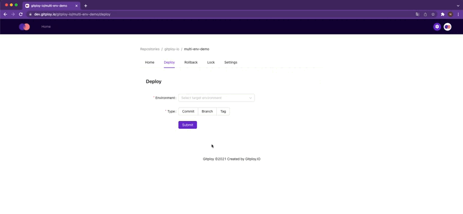

Having a well-tuned workflow keeps a team productive and helps them deliver reliable software. One recommended practice for any significant software development is using multiple environments. Using multiple environments ensures that software is rigorously tested before deployed and made available to users.

A general way for deploying to an environment is the branch strategy. Users create branches for each environment and deploy them by pushing a commit to the branch. Then, The deployment tool such as GitHub Action or Circle CI will deploy to the environment corresponding to the branch name.

The following is an example implemented by a GitHub   Action. Firstly, it wants to trigger the workflow on push events for specific branches such as `dev` and `prod`. And in the step, through the `if` syntax, the workflow deploys it to a different environment for each branch.

<details>
<summary>Deploy By Branch Push</summary>

```yaml title=".github/workflows/deploy-by-branch.yaml"
on:
  push:
    branches:
      - dev
      - staging
      - prod

jobs:
  deploy:
    runs-on: ubuntu-latest
    steps:
      - 
        name: Set env vars for dev
        if: github.ref_name == 'dev'
        run: |
          echo "AZURE_FUNCTIONAPP_NAME=gitploy-dev" >> $GITHUB_ENV
          echo "PUBLISH_PROFILE_VAR_NAME=AZURE_FUNCTIONAPP_PUBLISH_PROFILE_DEV" >> $GITHUB_ENV
      - 
        name: Set env vars for prod
        if: github.ref_name == 'prod'
        run: |
          echo "AZURE_FUNCTIONAPP_NAME=gitploy-prod" >> $GITHUB_ENV
          echo "PUBLISH_PROFILE_VAR_NAME=AZURE_FUNCTIONAPP_PUBLISH_PROFILE_PROD" >> $GITHUB_ENV
      - 
        uses: Azure/functions-action@v1
        with:
          app-name: ${{ env.AZURE_FUNCTIONAPP_NAME }}
          publish-profile: ${{ secrets[env.PUBLISH_PROFILE_VAR_NAME] }}
          respect-funcignore: true
```
</details>

**However, although the branch strategy is easy and fast, it is not flexible and scalable.** The user must create a new branch and modify the workflow if a new environment is added.

On the other hand, Gitploy provides another solution. **Gitploy dispatches an event that includes information necessary for deployment, such as the environment name, Function App name, and so on, through the [deployment API](https://docs.github.com/en/rest/reference/deployments#deployments) when a user triggers.** To activate Gitploy, we should place the `deploy.yml` file in the root of the git repository like below. Note that the `payload` field has the extra information for deployment, and it has different information for each environment, respectively. When a user triggers, the `payload` is passed to the deployment tooling.

<details>
<summary>deploy.yml</summary>

```yaml title="deploy.yml"
envs:
  - name: dev
    auto_merge: false
    payload:
      AZURE_FUNCTIONAPP_NAME: gitploy-dev
      PUBLISH_PROFILE_VAR_NAME: AZURE_FUNCTIONAPP_PUBLISH_PROFILE_DEV
  - name: prod
    auto_merge: false
    payload:
      AZURE_FUNCTIONAPP_NAME: gitploy-prod
      PUBLISH_PROFILE_VAR_NAME: AZURE_FUNCTIONAPP_PUBLISH_PROFILE_PROD
```

</details>

And in the workflow, the information for deployment is read through the `github.event.deployment.payload` context. The thing is that the workflow does not need `if` syntax for conditional steps anymore because an event has information.

<details>
<summary>Deploy By Gitploy</summary>

```yaml title=".github/workflows/deploy-by-gitploy.yaml"
on:
  deployment

jobs:
  deploy:
    runs-on: ubuntu-latest
    steps:
      - 
        uses: chrnorm/deployment-status@releases/v1
        with:
          deployment_id: ${{ github.event.deployment.id }}
          description: Start to deploy.
          state: "in_progress"
          token: "${{ github.token }}"

      - 
        uses: Azure/functions-action@v1
        with:
          app-name: ${{ github.event.deployment.payload['AZURE_FUNCTIONAPP_NAME'] }}
          publish-profile: ${{ secrets[github.event.deployment.payload['PUBLISH_PROFILE_VAR_NAME'] }}
          respect-funcignore: true
      
      - 
        if: success()
        uses: chrnorm/deployment-status@releases/v1
        with:
          deployment_id: ${{ github.event.deployment.id }}
          description: Success to deploy.
          state: "success"
          token: "${{ github.token }}"
      - 
        if: failure()
        uses: chrnorm/deployment-status@releases/v1
        with:
          deployment_id: ${{ github.event.deployment.id }}
          description: Failed to deploy.
          state: "failure"
          token: "${{ github.token }}"
```

</details>

Finally, when you trigger on Gitploy, you can see that it successfully deploys to the environment. 🚀 



*Thanks for reading, and stay tuned for a more good read. If you have a question, please post questions or comments to our [community](https://github.com/gitploy-io/gitploy/discussions)*

**Reference**

* [Github Actions: deploy to multiple environments from single workflow](https://www.maxivanov.io/github-actions-deploy-to-multiple-environments-from-single-workflow/)
* [multi-env-demo](https://github.com/gitploy-io/multi-env-demo)

