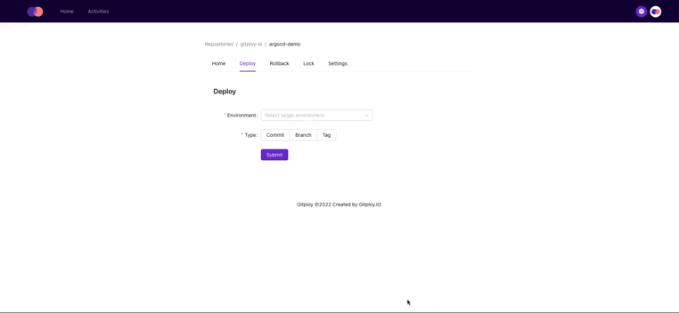
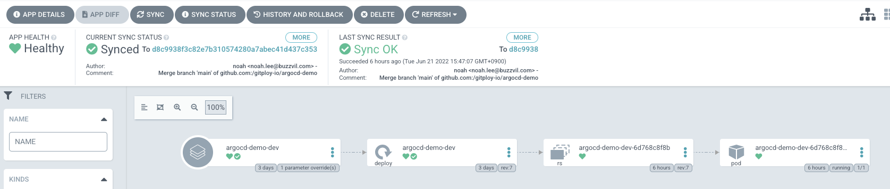

## Deployment Strategy of Argo CD

[Argo CD](https://argo-cd.readthedocs.io/en/stable/) is the most popular GitOps tool for Kubernetes. Argo CD makes it easy to define an application with its desired state in a repository and where it should be deployed. After a deployment, **Argo CD constantly tracks updates to branches, tags, or pinned to a specific version of manifests at a Git commit.**

Argo CD provides [several different ways](https://argo-cd.readthedocs.io/en/stable/user-guide/tracking_strategies/) of tracking Kubernetes resource manifests. Among them, **commit pinning is typically used to control production environments.** Since commit SHAs cannot change the meaning, the live state of an application can be fixed and predictable. So the application remains stable.

- HEAD / Branch Tracking
- Tag Tracking
- Commit Pinning

## Commit Pinning By CLI

Now, we'll deploy the manifest in a specific commit from the Argo CD. First, before starting the demo, install the `argocd` command. More detailed installation instructions can be found via the CLI [installation documentation](https://argo-cd.readthedocs.io/en/stable/cli_installation/).

The [repository](https://github.com/gitploy-io/argocd-demo) to be used as a demo has Kubernetes resources manifests under the `app/` directory and it is customized through [`kustomize`](https://kubectl.docs.kubernetes.io/guides/introduction/kustomize/) for each environment.

<details>
<summary>File Structure</summary>

```shell
app
├── base
│   ├── deployment.yaml
│   └── kustomization.yaml
└── overlays
    ├── dev
    │   └── kustomization.yaml
    └── prod
        └── kustomization.yaml
```

</details>

First, we should create an Application for Argo CD:

<details>
<summary>Create App</summary>

```shell
argocd app create argocd-demo-prod \
    --repo https://github.com/gitploy-io/argocd-demo.git \
    --path app/overlays/prod  \
    --dest-server https://kubernetes.default.svc \
    --dest-namespace argocd \
	--sync-policy automated
```

</details>

We should change the Application's revision to the commit SHA. At the same time, we also update the image tag with commit SHA:

<details>
<summary>Update App</summary>

```shell
argocd app set argocd-demo-prod \
	--revision COMMIT_SHA \
	--kustomize-image gitployio/argocd-demo=gitployio/argocd-demo:sha-COMMIT_SHA
```

</details>

Finally, We should synchronize the desired state to the Kubernetes cluster:

<details>
<summary>Sync App</summary>

```shell
argocd app sync argocd-demo-prod --timeout 300
```

</details>

Then, Argo CD continuously synchronizes the manifest of the commit. As a result, the desired manifest and the live state of Kubernetes are always synchronized.

## Integration With Argo CD



Commit pinning is appropriate for production environments, but changing revisions every time is difficult. As a result, many teams (or organizations) adopt HEAD/branch tracking because it is much easier than the commit pinning.

But the good thing is that Gitploy can solve this problem easily. Gitploy provides the way to deploy a commit easily, and the deployment event, which is dispatched to CD tooling, includes the commit SHA value. So the CD tool will be able to execute `argocd app set` command with the commit SHA from the deployment event.

Below is an example of a pipeline built with Gitploy and GitHub Actions. When Gitploy deploys a commit, it passes the payload including the Application name of the Argo CD to be deployed, and The GitHub Action pipeline accesses `github.event.deployment.payload` to get the Application name. Also, the GitHub Action pipeline gets the commit SHA through the `github.sha` value to deploy.

<details>
<summary>Gitploy Configuration</summary>

```yaml
envs:
  - name: dev
    auto_merge: false
    required_contexts:
      - "publish-image"
    payload:
      application: argocd-demo-dev
  - name: prod
    auto_merge: true
    required_contexts:
      - "publish-image"
    production_environment: true
    payload:
      application: argocd-demo-prod
```

</details>

<details>
<summary>GitHub Action Pipeline</summary>

```yaml
name: deploy

on:
  deployment

jobs:
  deploy:
    runs-on: ubuntu-latest
    steps:
      - 
        uses: chrnorm/deployment-status@releases/v2
        with:
          deployment-id: ${{ github.event.deployment.id }}
          description: Trigger the pipeline
          state: "queued"
          token: "${{ github.token }}"
      - 
        uses: chrnorm/deployment-status@releases/v2
        with:
          deployment-id: ${{ github.event.deployment.id }}
          description: Start to deploy to the Kubernetes
          log-url: https://gitploy.jp.ngrok.io/applications/${{ github.event.deployment.payload.application }}
          state: "in_progress"
          token: "${{ github.token }}"
      - 
        name: Log in
        uses: clowdhaus/argo-cd-action/@main
        with:
          version: 2.3.3
          command: login gitploy.jp.ngrok.io
          options: >
            --username 
            admin 
            --password 
            ${{ secrets.ARGOCD_PASSWORD }}
      - 
        name: Set image tag
        uses: clowdhaus/argo-cd-action/@main
        with:
          version: 2.3.3
          command: app set ${{ github.event.deployment.payload.application }}
          options: >
            --revision ${{ github.sha }}  
            --kustomize-image gitployio/argocd-demo=gitployio/argocd-demo:sha-${{ github.sha }}
      - 
        name: Sync
        uses: clowdhaus/argo-cd-action/@main
        with:
          version: 2.3.3
          command: app sync ${{ github.event.deployment.payload.application }}
          options: >
						--timeout 300
      - 
        name: Wait
        uses: clowdhaus/argo-cd-action/@main
        with:
          version: 2.3.3
          command: app wait ${{ github.event.deployment.payload.application }}
          options: >
            --health
            --timeout 600
      - 
        if: success()
        uses: chrnorm/deployment-status@releases/v2
        with:
          deployment-id: ${{ github.event.deployment.id }}
          description: Finish to deploy successfully.
          log-url: https://gitploy.jp.ngrok.io/applications/${{ github.event.deployment.payload.application }}
          state: "success"
          token: "${{ github.token }}"
      - 
        if: failure()
        uses: chrnorm/deployment-status@releases/v2
        with:
          deployment-id: ${{ github.event.deployment.id }}
          description: Failed to deploy.
          log-url: https://gitploy.jp.ngrok.io/applications/${{ github.event.deployment.payload.application }}
          state: "failure"
          token: "${{ github.token }}"
```

</details>

Now, when we deploy from Gitploy, we can see that the Argo CD pins the Application to the manifests defined at the specified commit. More details for the demo can be found in this [repository](https://github.com/gitploy-io). :)


