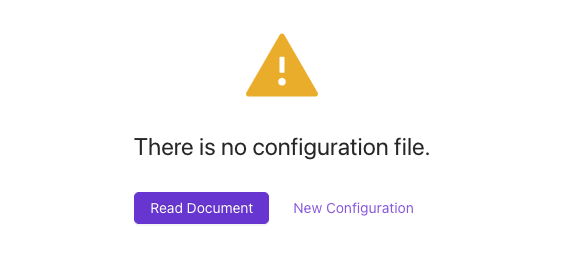

Gitploy provides the way users can configure pipelines by a simple file, such as **deployment trigger**, **deployment safety**, and **deploying** to a runtime environment🚀. The syntax is designed to be easy to read and expressive so that anyone can understand the pipeline. You can check the [documentation](../references/deploy.yml.md) for the syntax of the file.

Pipelines are configured by placing a `deploy.yml` file in the root of your git repository. And if you want to change the file path, you can do it on the settings page.  

*⚠️ Note that the configuration file must be at the head of the default branch.* 

## Quick Start
If you want to get started quickly, you should click the *New Configuration* link, copy the `deploy.yml` file, and push it into your git repository. Then you can find the `production` environment in the deploy tab.



```yaml title="deploy.yml"
envs:
  - name: production
    auto_merge: false
    # To avoid the context verification.
    # required_context: []
```

## Deployment Trigger

### Auto Deploy
Gitploy provides continuous delivery basically, but it also provides **continuous deployment**. The deployment will be triggered automatically if any new push events are detected from GitHub.
 To enable continuous deployment, you should configure the `auto_deploy_on` field. Gitploy triggers a deployment when a `ref` of the push event is matched with the field.

This configuration also supports a regular expression to match with the specific pattern. It allows you to deploy on any tag (i.e., `refs/tags/.*`) or to match specific branches (i.e., `refs/heads/(main|master)`).

```yaml title="deploy.yml"
envs:
  - name: production
    auto_deploy_on: refs/heads/main
```

## Deployment safety

### Deployable Ref

The `ref` can be any named branch, tag, or SHA. But sometimes, a `ref` must be specific branches or tags. You can verify a `ref` matched with the format by configuring the `deployable_ref` field. And this configuration also supports a regular expression.

```yaml title="deploy.yml"
envs:
  - name: production
    deployable_ref: "v.*"
```

### Deploy Freeze Window
If you want to prevent deployments for a particular period, such as during a planned vacation period or out of working time, you can configure the `frozen_windows` field. During a deploy freeze period, users can not execute any deployment. 

And this configuration uses the cron expression to handle repetitive periods. You can check the detail in the [documentation](../references/deploy.yml.md).

```yaml title="deploy.yml"
envs:
  - name: production
    frozen_windows:
      # Freeze every midnights
      - start: "50 23 * * *"
        duration: 20m
        location: America/New_York
      # Freeze every weekends
      - start: "0 * * * SAT,SUN"
        duration: 1h
        location: Asia/Seoul
```

### Review
If you require a specific person, such as a service owner or product manager, to review what is deployed before deployment, you can configure the `review` field. You can list up users as reviewers under the `review` field. Then Gitploy requests a review to users by sending a notification when a deployment is triggered.

```yaml title="deploy.yml"
envs:
  - name: production
    review:
      enabled: true
      reviewers: ["ocotocat", "manager"]
```

## Deploy 🚀

### Parameters of GitHub deployment API
As the 'How it works' documentation mentioned, Gitploy sends a request by deployment API. You can configure all the parameters in a configuration file.

```yaml title="deploy.yml"
envs:
  - name: production
    task: deploy:lambda
    description: Deploy to the production lambda.
    auto_merge: false
    required_contexts:
      - test
      - integration-test
    production_environment: true
```

