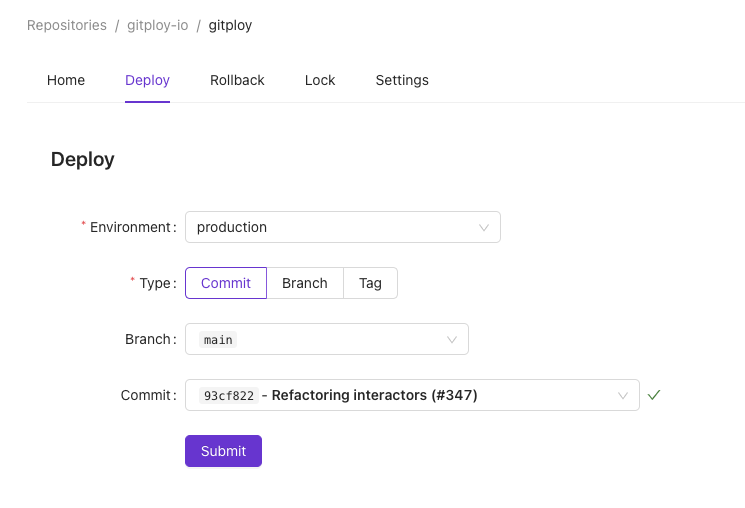

# Deployment

## How to deploy?
**Gitploy provides an intuitive UI that allows users to deploy a specific `ref`.** The UI provides three types of `ref`: *commit*, *branch*, and *tag*. The UI shows a list of options for each type. For example, the UI shows the current commit list with information such as SHA, description, committer if the user selects a commit.

When the user selects `ref`, an icon indicating the commit's status appears on the right, and you can check the subset of contexts by clicking the icon. This information can be handy if you use the `required_contexts` field, which specifies a subset of contexts that must be `success`.

After that, when you click the deploy button, Gitploy sends a deployment request to GitHub. The selected `ref` is used as a request parameter when requesting. And other parameters are filled with `deploy.yml` field values.

## Deployment Status
Gitploy provides the UI to view the status after deployment. If you click `View Detail` of the deployment history on the Home tab, the link will take you to the page. 

The page allows you to follow up on the changes through the status field. Each status has a description, update time, and a `View` link. The `View` link, when clicked, takes you directly to a deployment tooling and displays details.

