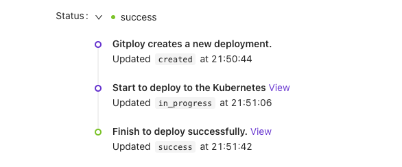

# How it works

Gitploy builds the system around GitHub [deployment API](https://docs.github.com/en/rest/reference/deployments#deployments). Deployment API is a request to deploy a specific ref (branch, SHA, tag), and GitHub dispatches an event to deployment toolings that can listen for and act on when a request is posted. **It's an event-driven decoupled way to deploy your code.** This article looks under the hood Gitploy interacts with deployment API.


## GitHub Deployment API

The deployment API consists of these stages:

1. A user selects a ref(branch, SHA, tag) to deploy.
2. Gitploy verifies the ref for deployment safety.
3. It requests GitHub to deploy a specific ref. 

Of course, Gitploy follows these stages to deploy a ref and enhances each stage to use it easily and safely.

### Select a ref(branch, SHA, tag)

A ref can be any named branch, tag, or SHA, and it is determined by how to deploy an application. If an application uses semantic versioning, the ref should be a tag(e.g., `v0.5.5`).

Gitploy provides an intuitive UI similar to GitHub, enabling users to select a ref easily even though a user is a newcomer to the system. And it displays the details of a commit such as SHA, message, creator, and creation time. So it enables to let users know which commits are deployed.

### Verification

Before deploying a ref, it needs verification for deployment safety. The deployment API provides these verifications: 

* `auto_merge`: Ensure that the requested ref is not behind the repository's default branch. 
* `required_contexts`: Ensure that commit statuses are in that success state.

Gitploy provides the file (i.e., `deploy.yml`) to configure the parameters for each runtime environment, respectively. 

### Event Dispatch

Gitploy posts a request to GitHub, and it dispatches an event to deployment toolings.

## Deployment Tooling

### Update status

After deployment, a deployment tooling must update the deployment status if it has succeeded or not by the [deployment status API](https://docs.github.com/en/rest/reference/deployments#deployment-statuses). It enables Gitploy to sync the deployment status and display the deployment status with a redirection link for the deployment details, such as logs.



Below is a simple diagram for how these interactions would work:

```
+---------+             +--------+             +---------+         +-------------+
| Gitploy |             | GitHub |             | Tooling |         | Your Server |
+---------+             +--------+             +---------+         +-------------+
     |                      |                       |                     |
     |  Create Deployment   |                       |                     |
     |--------------------->|                       |                     |
     |                      |                       |                     |
     |  Deployment Created  |                       |                     |
     |<---------------------|                       |                     |
     |                      |                       |                     |
     |                      |   Deployment Event    |                     |
     |                      |---------------------->|                     |
     |                      |                       |     SSH+Deploys     |
     |                      |                       |-------------------->|
     |                      |                       |                     |
     |                      |   Deployment Status   |                     |
     |                      |<----------------------|                     |
     |                      |                       |                     |
     |                      |                       |                     |
     |                      |                       |                     |
     |                      |                       |   Deploy Completed  |
     |                      |                       |<--------------------|
     |                      |   Deployment Status   |                     |
     |                      |<----------------------|                     |
     |                      |                       |                     |
     |                      |                       |                     |
     |                      |                       |                     |
```

*Keep in mind that Gitploy is never actually accessing your servers. It's up to your tools to interact with deployment events.*
