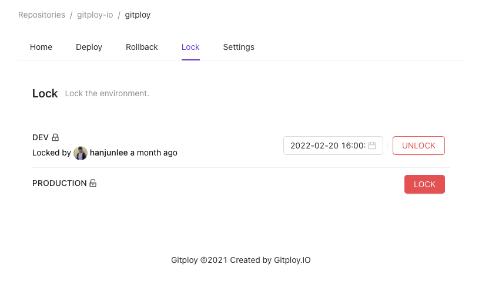

# Lock

## Locking deployments

There are some situations where you may want to block a deployment. If someone else deploys to the same environment while debugging in the production environment, this may worsen the issue. In this case, the locking deployments buy time to resolve the issue as you see fit.

Gitploy provides locking for each environment. You can use it simply by clicking the 'LOCK' button.

Gitploy also provides automatic unlocking. Generally, users forget to unlock after locking. The auto-unlock provides a function automatically unlocked after a specific time. It can be set to be unlocked after a certain period that requires locking for a certain period, such as canary deployment.

