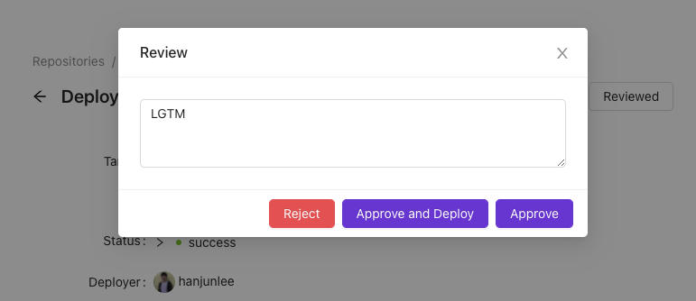
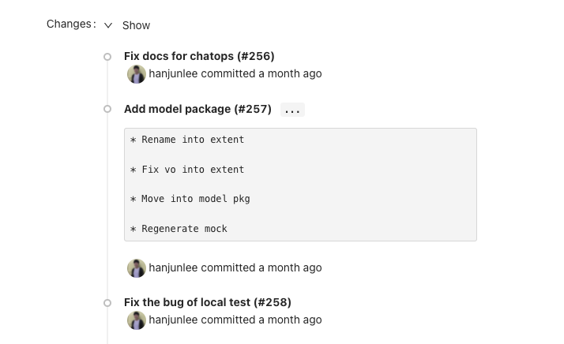

# Review

## About required review
Users can enable the review in the `deploy.yml` file for each environment, and the users who review are specified here. Reviewers must have at least read permission.

```yaml title="deploy.yml"
envs:
  - name: production
    review:
      enabled: true
      reviewers: ["octocat", "dreamer"]
```

After the review is enabled, reviews are requested when a user deploys. And the deployment waits until a review is approved and has a status of `waiting`. Only one of the required reviewers needs to approve it to proceed. If one rejects it, deployment is not possible. If a deployment is not approved within 30 minutes, it will be automatically canceled.

The notification will navigate to the deployment page when a review is requested. And when the reviewer presses the 'Review' button on the page, a pop-up shows options for approval and rejection. To approve, click **Approve and Deploy**. After approved, the deployment will proceed (after any deployment protection rules have passed).



## Pro Tips

### Confirm Changes
The 'Changes' field at the bottom of the page shows what changes have been made. Reviewers can quickly check what has changed through the commit messages.


