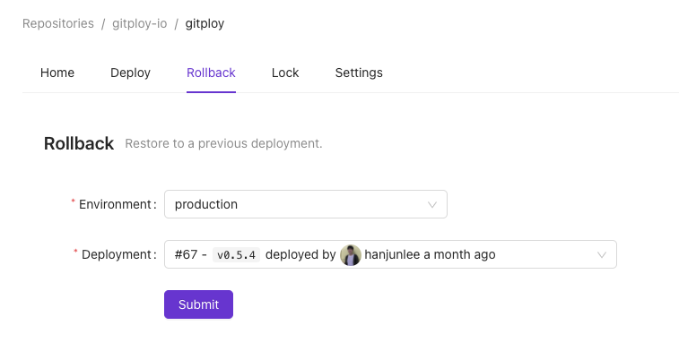

# Rollback

## How to roll back?
We generally run `git revert` and merge the code to roll back. But in this process, we must wait for CI for a long time, which causes an impact on users. Therefore, the rollback must be done quickly and accurately.

**Gitploy provides a quick and easy one-click rollback.** The UI shows a list of completed deployments of which status is `success` when the user selects a runtime environment. And the first option is just the previous deployment.

After that, when the user clicks rollback, Gitploy fetches the payload from the previous deployment and sends a deployment request with the payload to Github. The `ref` from the previous deployment is used in this case. *However, if the ref of the previous deployment is a branch, Gitploy uses SHA to prevent the head of the branch from being deployed.* 

*Note that `auto_merge: false` is set internally to avoid merge conflicts when rollback.*

