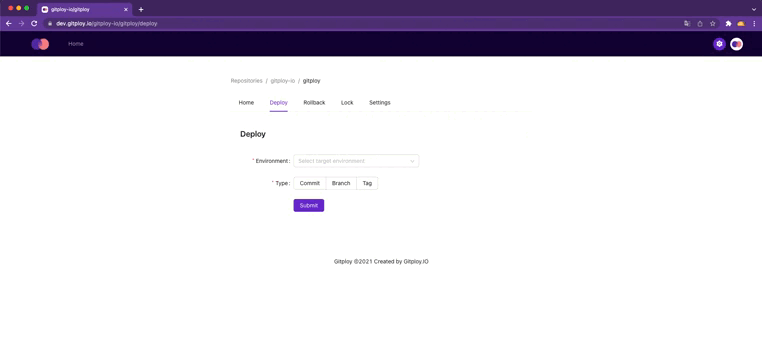

Gitploy is a tooling that helps your organization build the deployment system in minutes. It enables your organization **to deploy in the same manner** without worrying about  the implementation details of delivering different types of applications (e.g., web, native) and **to set up a deployment pipeline differently** with a simple configuration file for each application, respectively. And as a result, your organization can get a robust system to deploy fast and safely. 🚀

## Deploy in the same manner

An organization has different types of applications, and it needs different deployment toolings for each application. For example, if an organization uses the Kubernetes for servers and the S3 for static websites, they generally choose different toolings. In my case, I used to choose Spinnaker for Kubernetes and CI tools (Ex. GitHub Action) for S3.

But multiple tooling has a risk of increasing the complexity of the system. It costs users quite a lot of times to deploy because each tooling has a different interface. And also, it is hard to manage deployments in one place because they are distributed. If an organization needs it, they should collect and aggregate it by themselves.

Gitploy resolves the complexity perfectly. It always provides **the way to deploy in the same manner.** The users who want to deploy don't need to know which infrastructure they deploy or which toolings they use anymore. They just deploy it, without worrying about the implementation details.

Gitploy provides an intuitive UI similar to GitHub. Users can select one of the commits, branches, or tags to deploy and follow up on the deployment status.



## Set up a deployment pipeline differently

Each application needs a customized pipeline. If an organization has core applications to deploy carefully, it should enforce a gateway like a review or deploy freeze window. And also an organization should chooses continuous delivery or continuous deployment for application.
 
Gitploy provides a way **to configure a pipeline with a simple, easy‑to‑read file for each repository (and each environment).** It is placed at `deploy.yml` as default, but you can replace the file path in the settings tab of Gitploy. 

Currently, Gitploy provides powerful options such as *`ref` verification*, *continuous delivery vs continuous deployment*, and *review*. You can check the documentation for the detail.

```yaml title="deploy.yml"
envs:
  - name: production
    task: deploy:kubernetes
    # Verify that the format of ref is the semantic versioning.
    deployable_ref: 'v.*\..*\..*'
    # Check the Docker image exists.
    required_contexts:
      - "publish-image"
    # Collect the metrics
    production_environment: true
    # Enable review
    review:
      enabled: true
      reviewers: 
        - octocat
```
