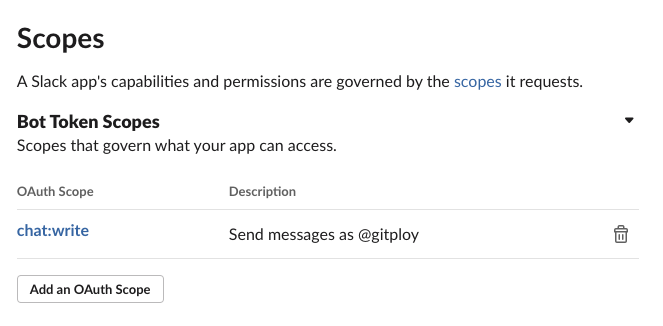

# Integration

## Deployment API

As described in the '[How it works](../concepts/how-it-work.md)' document, two preparations are required to connect with the deployment API; 1) Make sure your deployment tooling is listening for the Github [deployment](https://docs.github.com/en/developers/webhooks-and-events/webhooks/webhook-events-and-payloads#deployment) event. 2) Update the deployment status by [API](https://docs.github.com/en/rest/reference/deployments#create-a-deployment-status) after execution is complete. This document will show how you can connect with the mainstream deployment tools.

### GitHub Action

#### Listening for an event

GitHub Action provides the `on` syntax to define the type of activity that will trigger a workflow run, and it supports the deployment event. 

```yaml
on:
  deployment
```

And you can use the `if` conditional to run a job when an environment is met. You can use context to access the deployment environment.

```yaml
jobs:
  deploy-production:
    runs-on: ubuntu-latest
    if: ${{ github.event.deployment.environment === 'production' }}
```

#### Update the deployment status

The third-party plugin, [chrnorm/deployment-status](https://github.com/chrnorm/deployment-status), provides that a GitHub action updates the status of deployments as part of your GitHub CI workflows.


```yaml
jobs:
  deploy-dev:
    runs-on: ubuntu-latest
    steps:
      ...
      - 
        name: Update the deployment status
        uses: chrnorm/deployment-status@releases/v1
        with:
          token: "${{ github.token }}"
          deployment_id: ${{ github.event.deployment.id }}
          description: Finish to deploy successfully.
          state: "success"
```

You can reference this [example](https://github.com/gitploy-io/gitploy/discussions/178) for integrating with GitHub action.

### Drone CI

#### Listening for an event

Drone CI provides the `trigger` field to limit pipeline execution based on the drone event type, supporting the `promote` event. 

```yaml
trigger:
  event:
  - promote
```

And you can access the [`DRONE_DEPLOY_TO`](https://docs.drone.io/pipeline/environment/reference/drone-deploy-to/) environment by the environment if you need the conditional step. 

#### Update the deployment status

The third-party plugin, [cedrichopf/drone-status](https://github.com/cedrichopf/drone-status), provides that a Drone CI updates the status of deployments as part of your CI pipelines.

```yaml
steps:
  - name: Update the deployment status
    image: cedrichopf/drone-status
    settings:
      api_token:
        from_secret: GITHUB_TOKEN 
      context: deploy
      state: success
      description: Finish to deploy successfully.
```

### Spinnaker
TBU

### Internal Deployment Tooling

GitHub provides a well-organized [document](https://docs.github.com/en/rest/guides/delivering-deployments) to guide to build an internal deployment tooling to deploy on your servers with the Deployment API. 

## Notification

### Slack

#### Step 1: Create App

Firstly, we have to create [Slack App](https://api.slack.com/apps). You should click the Create App button and fill out inputs.

#### Step 2: Configure Permissions

After creating App, we move to the *OAuth & Permissions* page and set up *the redirect URLs* and *Bot Token scopes*on this page. Firstly, you should add a new redirect URL with the `GITPLOY_SERVER_PROTO://GITPLOY_SERVER_HOST/slack/signin` format; secondly, add `chat:write` scope into the Bot Token scopes.



#### Step 3: Run Server With App Credentials

To enable Slack integration, you have to set up these environments when you run the server: `GITPLOY_SLACK_CLIENT_ID` and `GITPLOY_SLACK_CLIENT_SECRET`. You can get these credentials from *App Credentials* section of *Basic Information* page. 
